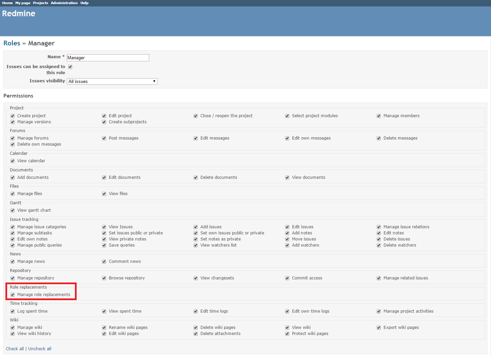
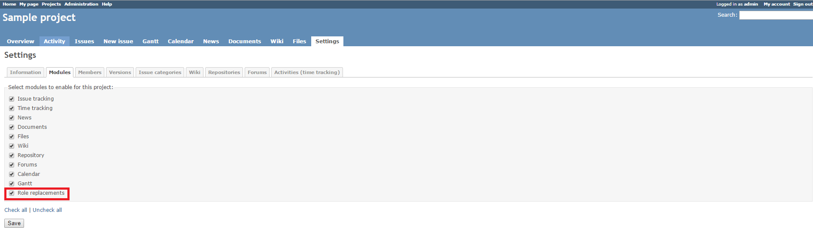
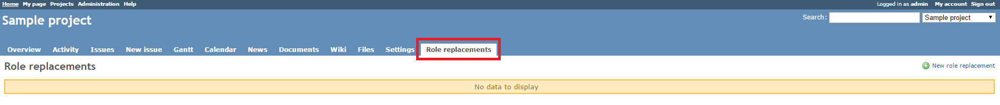
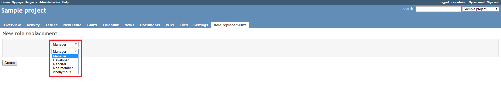
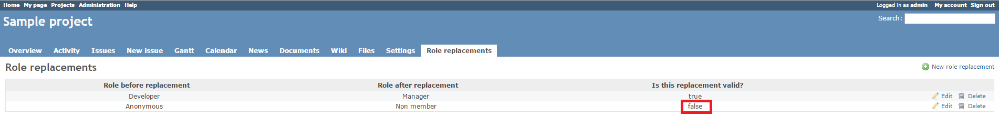
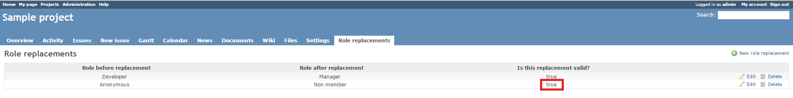

# Redmine Role Replacement Plugin

This plugin enables replacement of roles in Redmine projects.

## Compatibility

This plugin is compatible with Redmine 3.x.

## Installation

1. To install the plugin
    * Download the .ZIP archive, extract files and copy the plugin directory into *#{REDMINE_ROOT}/plugins*.
    
    Or

    * Change you current directory to your Redmine root directory:  

            cd {REDMINE_ROOT}
 
      Copy the plugin from GitHub using the following command:

            git clone https://github.com/Restream/redmine_role_replacements.git plugins/redmine_role_replacements

2. This plugin requires a migration. Run the following command to upgrade your database (make a database backup before):  

        bundle exec rake redmine:plugins:migrate RAILS_ENV=production

3. Restart Redmine.

Now you should be able to see the plugin in **Administration > Plugins**.

## Usage

The plugin adds the **Role replacements** section to the **Roles and permissions** tab of the **Administration** menu. 

You can select the **Manage role replacements** check box for the roles which should be allowed to replace roles in the project. By default, **Manage role replacement** is enabled for managers only. We recommend creating a special role for role replacement management.

To replace roles in a project, you should enable the **Role replacements** module in the project settings.  

If you have the **Manage role replacements** permission, you will see a new **Role replacements** tab, where you can add, edit and delete the project role replacement rules.

To add a role replacement rule, click **New role replacement**.  

In private projects, replacement of **Anonymous** and **Non member** roles is prohibited.

In public projects, all role replacement variants are possible.

The table below shows all possible role replacement variants and their results:

<table>
  <tr>
    <th colspan="3"></th>
    <th colspan="3">Role After</th>
  </tr>
  <tr>
    <th colspan="3"></th>
    <th>Anonymous</th>
    <th>Non Member</th>
    <th>Member</th>
  </tr>
  <tr>
    <th rowspan="6">Role Before</th>
    <th rowspan="3">Private Project</th>
    <th>Anonymous</th>
    <td>N/A</td>
    <td>N/A</td>
    <td>N/A</td>
  </tr>
  <tr>
    <th>Non Member</th>
    <td>N/A</td>
    <td>N/A</td>
    <td>N/A</td>
  </tr>
  <tr>
    <th>Member</th>
    <td>N/A</td>
    <td>N/A</td>
    <td>L J V</td>
  </tr>
  <tr>
    <th rowspan="3">Public Project</th>
    <th>Anonymous</th>
    <td>N/A</td>
    <td>L V</td>
    <td>L V</td>
  </tr>
  <tr>
    <th>Non Member</th>
    <td>L V</td>
    <td>N/A</td>
    <td>L V</td>
  </tr>
  <tr>
    <th>Member</th>
    <td>L J V</td>
    <td>L J V</td>
    <td>L J V</td>
  </tr>
</table>

* N/A — replacement is not valid and cannot be applied
* L — the project is visible in the project list
* J — the project is visible in the **Jump to a project** drop-down list
* V — the project can be accessed according to permissions of the target role (**Role After**)

## Maintainers

Danil Tashkinov, [github.com/nodecarter](https://github.com/nodecarter)

## License

Copyright (c) 2016 Restream

Licensed under the Apache License, Version 2.0 (the "License");
you may not use this file except in compliance with the License.
You may obtain a copy of the License at

http://www.apache.org/licenses/LICENSE-2.0

Unless required by applicable law or agreed to in writing, software
distributed under the License is distributed on an "AS IS" BASIS,
WITHOUT WARRANTIES OR CONDITIONS OF ANY KIND, either express or implied.
See the License for the specific language governing permissions and
limitations under the License.